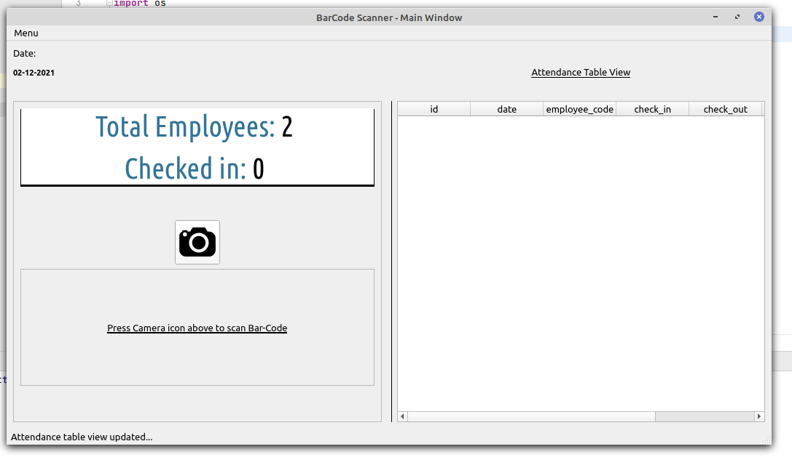

# Bar-Code Attendance System

### Features:

1. Add new employee to database if not already a registered employee.
2. Automatic checkin/checkout detection from reading previous check state.
3. Easy accessible UI design, with visual records for logged in employees.
4. Database: SQLite3 _(chosen due to the reson, user don't need to setup other database, and this application can be easily distributed)._

### Design:

    

