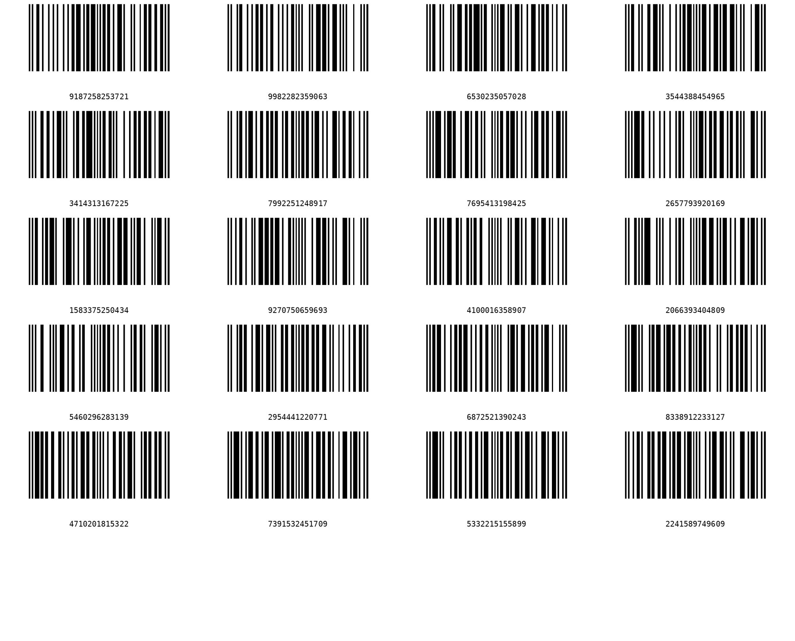

# Create Image Collage
**Pre-requisites**

    python >=3.7

Other modules required:

```bash
pip install pillow
pip install tqdm
```

To launch the application:
```python
python create_collage.py
```
To run application for optimizing images:
```python
python create_collage.py optimize
```
**and follow on screen input instructions to optimized image*
<hr>

**A file named "collage..n.png" will be generated in the present working directory.**
* where n is the number of files **already existing** in target output directory.
<hr>

## Sample output(s)

<p align="center">
    
    <br>
    <u>Sample barcodes collaged together</u>
</p>

<br>

<p align="center">
    
    <br>
    <u><b>2979</b> images collaged together</u>
</p>